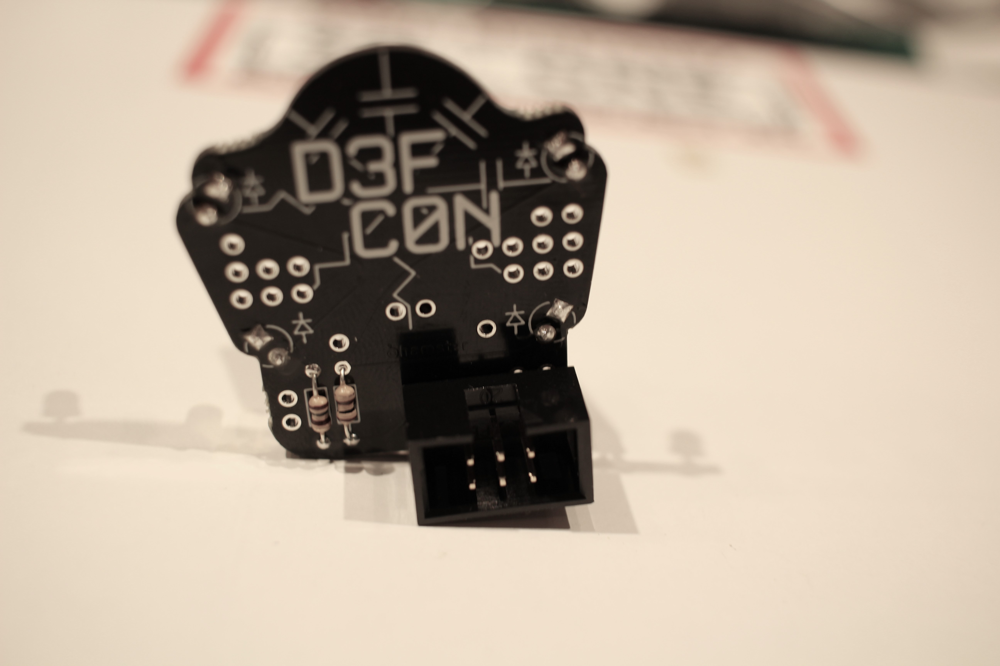

# Jack SAO

Jack is a simple SAO soldering kit.  Consisting of 4 LEDs in two colors, two resistors, and a connector, it's an easy way to learn how to solder.

To start, dump your kit out on the table and make sure you have all the parts pictured.  You'll need a soldering iron, solder, and a pair of wire cutters.

Locate the LEDs. Note that typically the LED is cast with a flat spot to indicate the cathode (or negative) terminal.  However, these small LEDS instead have the shorter leg as the cathode.

Look at the back of the PCB.  Note the diagram for the LEDS - the short legs of the LEDs will all go towards the top of the PCB.  This is also the square holes on the board.

It doesn't matter which color you put where.  Get crazy with it.  You can even leave the legs a little long and bend the LEDs to point out.  Whatever you want to do.

Insert the LEDs and flip over the PCB.  Make sure the short legs are going through the square holes.  Solder the legs into place.

Now that the LEDs are in place, you can clip the legs off with your wire cutters.

Locate the two resistors.  Bend their legs down and insert them from the back into the holes above and below the two rectangles on the lower left as shown.

Now flip the board over and push the resistors flat.  It helps here to bend the legs out so they can't slip while you are soldering.  Solder the legs down, and clip off the excess legs.

Finally, we need to install the SAO connector.  Locate the connector, and note on the back that the notch or tab needs to go 'up'.

Flip the board over, and solder the connector on.  I like to solder one pin, and then lift the board and pinch the connector while re-applying heat so that the connector is mounted flat, before finishing the solder of the rest of the pins.

You're all done!  Enjoy your SAO and let [me](https://twitter.com/hamster) know what you think!

