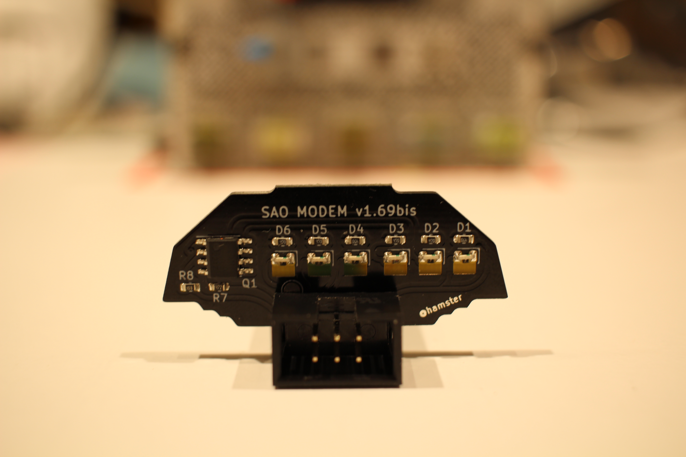

# SAO Modem 1.69bis

This SAO is designed to add some blinky lights to your badge, calling back to the days of an external Courier modem screaming away on the internet.

There are 6 lights:

- AA - Power, lights when 3.3v is present
- OH - Flashes on I2C SCL activity
- SD - Flashes on I2C SDA activity
- RTS - Flashes on GPIO1 activity
- CTS - Flashes on GPIO2 activity
- SYN - Connected to a free pad on the back, you choose what it does

The I2C inputs were selected to minimize load on the I2C bus, but this SAO might cause issues with badges with high speed I2C.  In that case, you can swap R7 and R8 for higher value resistors.

You will need to solder on the SAO connector.  Note that the notch or tab goes towards the top.  See photo for reference.  I like to insert the connector, solder one pin, then pinch the connector to the board with my fingers and re-heat this connection so that the connector snaps flat to the board before I solder on the rest of the pins.

